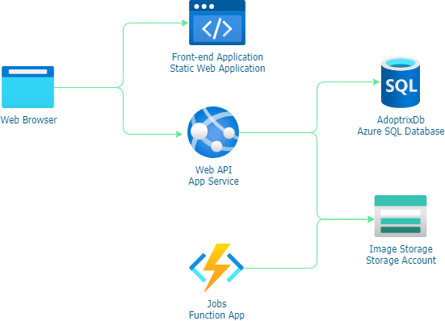

# Adoptrix - Pet adoption centre platform

## Description

Adoptrix is a platform for animal adoption centres to manage their animals and adoptions. It allows users to view animals available for adoption, and to submit adoption applications for animals they are interested in. It also allows adoption centre staff to manage their animals and applications.

## Architecture

The above diagram shows the basic architecture of the application.

### Front end

The user interface is an Angular application hosted with Azure Static Web Apps. It is served from a global CDN and uses Azure AD B2C for authentication.

### Back end

The back end is an ASP.Net Core API hosted with Azure App Service. It uses Azure SQL Server for data storage and Azure Blob Storage for file storage. It also uses Azure Functions for some background processing.

## Technologies

- ASP.Net Core
- Entity Framework Core
- Azure SQL Server
- Azure Blob Storage
- Azure Functions
- Azure AD B2C
  
## Attribution

This project uses the following resources:

- [Pet icons created by Freepik - Flaticon](https://www.flaticon.com/free-icons/pet)
